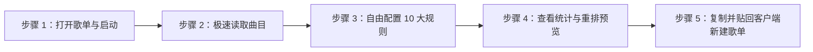

# 告别杂乱无章！我是如何打造一款 Spotify 歌单智能排序神器的？

> **项目开源地址**：[https://github.com/csxo/spotify-playlist-sorter](https://github.com/csxo/spotify-playlist-sorter)  
> **核心标签**：Spotify / 歌单整理 / Chrome 扩展 / 油猴脚本 / 纯本地 / 零配置

---

## 前言：歌单强迫症的“至暗时刻”

作为一名 Spotify 重度用户，我有一个收藏了 500 多首曲目的大歌单。但时间一长，这个歌单变成了一座“数字垃圾山”：

* 周杰伦的 30 多首歌、张信哲的 20 首歌像撒芝麻一样零碎散布在各个角落，想连续听某个歌手的作品必须手动点播；
* 很多仅收录了 1 首单曲的临时路人歌手，插在核心主力歌手中间，听歌体验经常被打断；
* 双人合唱、feat 合作曲目由于署名多艺人，原生往往只认第一作者，把同一位歌手参与的作品强行割裂；
* 还有更要命的：由于版本更迭、重置版（Remastered）和 Live 版重复添加，歌单里潜伏着几十首重复歌曲，肉眼核对犹如大海捞针。

我寻思：**为什么 Spotify 就不能按“歌手作品数量由多到少”帮我排好序呢？**

带着这个强烈诉求，我踏上了寻找方案的道路——然而市面上的插件无一例外：要求注册 Spotify 开发者、配置 Redirect URI、申请 Client ID / Secret、走复杂的 OAuth 授权；更痛苦的是，好不容易配置完了，Spotify 官方对修改歌单接口的风控极严，动辄报 `403 Forbidden`。

于是，我决定拉上 AI 结对编程助手，自己动手打造一款**真正 100% 纯本地、零 Token、零配置、丝滑高效**的 Spotify 歌单智能排序工具！

---

## 一、 前期思路与“连环踩坑”纪实

在开发初期，我们并不是一帆风顺的，整个过程堪称一部“斗智斗勇史”：

### 坑 1：官方 API 的“写权限高墙”与 403
我们最开始设想调用官方 Web API（`PUT /playlists/{id}/tracks`）直接原地写回排序结果。但现实迅速泼了冷水：Spotify 对第三方写权限风控极其严苛，普通免登录会话没有写权限，如果走正式 OAuth，每个用户都要去注册开发者账号，门槛高到飞起。
* **领悟**：**放弃暴力原地覆写，转为寻找更安全、更原生、零门槛的导入通道！**

### 坑 2：虚拟列表（Virtual DOM）的滚屏梦魇
Spotify 网页端为了性能，采用了虚拟列表技术——视口里永远只渲染可见的几十行 DOM。我们最初采用自动模拟滚屏扫描 DOM，结果遇到了致命问题：
* 脚本滚屏速度太快，而 Spotify 向服务器异步加载下一批歌曲需要网络时间；
* 导致页面经常出现短暂的骨架屏（Skeleton），扫描器误判漏歌；
* 用户必须手动把页面滚到底部“预热”DOM，或者反复扫描很多遍才能凑齐 500 多首歌，体验极差。

### 坑 3：重复歌曲误判与对位丢失
在歌单中存在下架置灰曲目或多版本同名曲时，简单的数组索引对位容易产生漂移，导致排完序后歌曲元数据错位。

---

## 二、 架构破局：四大技术突破

为了将体验做到极致，我们对整体底层架构进行了全面重构：

### 1. 突破一：发现原生 Web Player 会话，0.5 秒云端直读（Tier 1）
我们深入分析了 Spotify Web 播放器的底层网络流量，发现了一个极其关键的接口：
```http
GET https://open.spotify.com/get_access_token?reason=transport&productType=web_player
```
这是网页播放器本身为了流媒体播放而持有的原生登录会话！因为**读取歌单数据**（`GET /playlists/{id}/tracks`）只需要只读权限，扩展能够静默获取这个原生凭据，以每页 100 首并发直连 Spotify 云端数据库。
* **效果**：**彻底绕过 DOM 虚拟滚动！** 500+ 首歌曲的完整元数据（全部歌手、专辑、发行年份、Track URI）在 **0.5 秒内 100% 完整读取**，再也不需要手动滑屏！

### 2. 突破二：DOM 智能对位扫描双保险（Tier 3）
即便在极端断网或会话异常触发纯 DOM 扫描兜底时，我们通过 CSS `translateY` 绝对位移换算物理槽位，消除了下架置灰曲目的偏移，并彻底去除了补漏限制，确保任何情况下都能 100% 回溯自愈。

### 3. 突破三：剪贴板无损导入，与桌面端原生联动
既然 Spotify 网页端不支持批量覆写，那怎么把排好序的歌单落地？
我们发现了一个 Spotify 桌面客户端鲜为人知但极其强大的底层特性：**客户端原生支持直接将以换行分隔的 Spotify 歌曲链接（Track URI）粘贴为歌曲！**
* 用户只需点击一次「📋 复制排序结果」；
* 打开 Spotify 电脑客户端，新建歌单，直接按下 `Ctrl + V`（Mac 为 `Cmd + V`）；
* **千首歌曲在 1 秒内瞬间灌入！** 零 API 报错，绝不损坏原歌单，新旧对比安全感拉满！

### 4. 突破四：10 大专业排序规则与可视化看板
* **汉字拼音比较器**：基于 `Intl.Collator('zh-Hans-CN')`，让周杰伦、张信哲、五月天顺滑按汉语拼音首字母排序；
* **单曲散客统一置底**：仅收录 1 首的零散歌手全部挪至歌单尾部集中排列；
* **feat. 智能归属**：多歌手合唱歌曲，自动归拢给歌单中曲目最多的核心歌手名下；
* **语义去重引擎**：自动识别 URI 相同或版本重复的曲目，支持一键批量清理；
* **可视化数据看板**：直观展示歌手作品百分比色彩条与 Top 歌手数据胶囊，点击胶囊可直接瞬时过滤该歌手曲目。

---

## 三、 极简实操：30 秒搞定歌单重排

整个操作流程极其顺滑，已提炼为标准的 5 步走：



### 步骤 1：进入歌单并启动重排
在浏览器打开任意想要整理的 Spotify 歌单，在播放控制栏右侧（`...` 旁边），直接点击绿色的 **「🎵 智能排序歌单」** 按钮：


---

### 步骤 2：极速读取曲目与去重检测
工具自动接入原生会话通道，500 多首歌在 **0.5 秒内极速抓取完毕**，界面实时展现读取进度条与已加载曲目数：


---

### 步骤 3：自由定制 10 大专业排序规则（可选）
点击「⚙️ 规则说明与高级筛选」抽屉，所有规则（歌手聚合维度、单曲歌手位置、同一歌手内按 A-Z 或发行年份排序等）均开放点选，即选即生效：


---

### 步骤 4：查看歌手曲目统计看板与重排预览
在主界面查看核心统计数据（总歌曲数、聚合歌手数、单曲歌手数、变动比例），并通过**歌曲占比色彩分布条**与 **Top 歌手胶囊**进行实时筛选过滤：


---

### 步骤 5：一键复制结果，桌面端秒级粘贴
1. 点击弹窗右下角的 **「📋 复制排序结果 (516 首)」**；
2. 界面弹出复制成功提示，排好序的所有歌曲链接已保存在剪贴板中；
3. 打开 **Spotify 电脑桌面客户端**，点击「＋ 新建歌单」；
4. 按下快捷键 **`Ctrl + V`**（Mac 上为 **`Cmd + V`**），整齐划一的新歌单秒速生成！


> 💡 **关键避坑小贴士**：  
> 部分 Spotify 桌面客户端版本要求歌单中**至少先存在 1 首歌曲**（歌曲表格组件挂载后）才能响应快捷键。若新建的空白歌单按 `Ctrl + V` 无反应，只需**随手往里添加 1 首歌作为占位符**，然后再按 `Ctrl + V` 即可全量导入！

---

## 四、 开源与上线成果

经过完整的单元测试、集成测试与真实大歌单实测验证，项目已正式采用 **MIT 协议** 全面开源！

### 交付形态与获取方式
无论你是 Chrome / Edge 扩展爱好者，还是油猴脚本死忠粉，都能直接使用：

1. **GitHub 开源主页**：  
   👉 [https://github.com/csxo/spotify-playlist-sorter](https://github.com/csxo/spotify-playlist-sorter)
2. **Chrome / Edge 扩展程序（v1.0.0）**：  
   下载 Releases 中的 `spotify-playlist-sorter-chrome-extension.zip`，解压后在 `chrome://extensions/` 点击“加载已解压的扩展程序”即可开箱即用。
3. **Violentmonkey / Tampermonkey 油猴脚本（v1.0.0）**：  
   直接安装仓库中的 `spotify-playlist-sorter.user.js`，完全零配置。

---

## 结语：打造属于自己的数字秩序感

歌单不仅是歌曲的集合，更是我们个人审美品味与记忆轨迹的切片。把散乱无序的数百首歌曲梳理成脉络清晰的歌手图景，戴上耳机播放的那一刻，那种舒适与连贯感是无可替代的。

如果你也和我一样深受 Spotify 歌单混乱之苦，欢迎试用这款小工具！如果它帮到了你，不妨在 GitHub 上给个 ⭐ **Star** 支持一下，也欢迎提交 Issue 和 PR 共同完善它！
