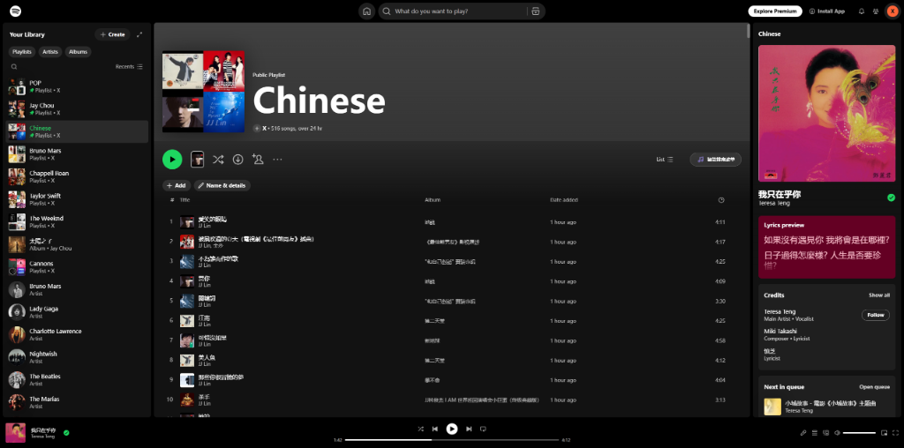
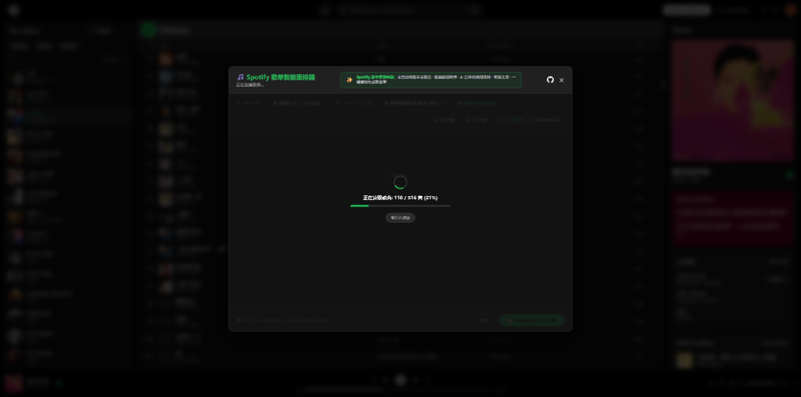
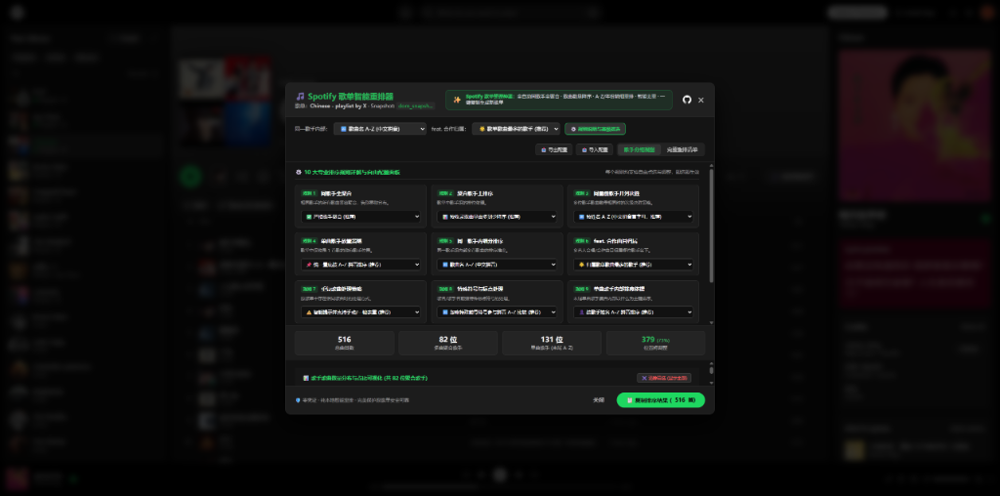
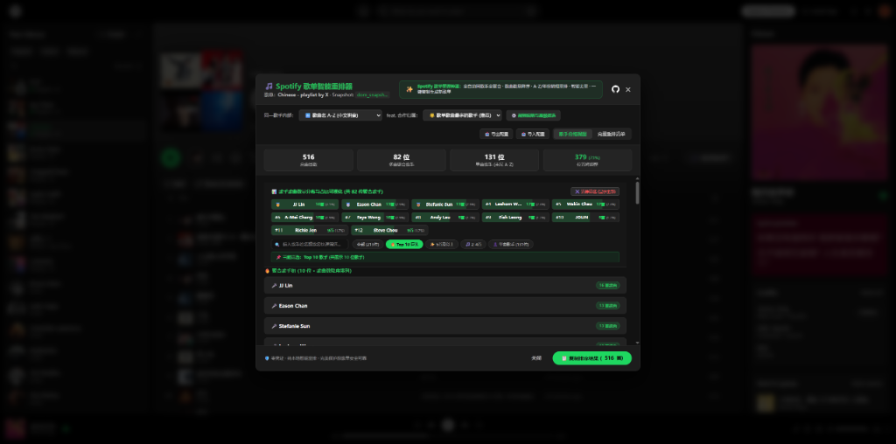

# 🎵 Spotify 歌单智能重排器 (Spotify Playlist Auto Sorter)

[](https://github.com/csxo/spotify-playlist-sorter)
[](https://opensource.org/licenses/MIT)
[](./extension)
[](./spotify-playlist-sorter.user.js)
[]()
[]()

> **专为 Spotify 深度用户与歌单整理强迫症打造的 100% 纯本地、零 Token、零配置的歌单智能整理与去重神器。**  
> 支持同歌手歌曲全聚合、按歌曲量降序、歌名拼音 A-Z / 发行年份精细重排、单曲歌手统一置底、重复歌曲智能清理、歌手分布可视化看板，一键复制秒速生成井井有条的新歌单！

* GitHub 仓库：[https://github.com/csxo/spotify-playlist-sorter](https://github.com/csxo/spotify-playlist-sorter)

---

## 📑 目录

- [🎵 Spotify 歌单智能重排器 (Spotify Playlist Auto Sorter)](#-spotify-歌单智能重排器-spotify-playlist-auto-sorter)
  - [📑 目录](#-目录)
  - [一、 痛点深度剖析：为什么你需要这款工具？](#一-痛点深度剖析为什么你需要这款工具)
  - [二、 项目简介与核心优势](#二-项目简介与核心优势)
  - [三、 10 大专业排序规则全自由配置](#三-10-大专业排序规则全自由配置)
  - [四、 智能去重管理模块](#四-智能去重管理模块)
  - [五、 歌手可视化统计与实时过滤](#五-歌手可视化统计与实时过滤)
  - [六、 2 种使用与安装形式（任选其一）](#六-2-种使用与安装形式任选其一)
    - [形式 1：Chrome / Edge 本地扩展程序（推荐，最省心）](#形式-1chrome--edge-本地扩展程序推荐最省心)
    - [形式 2：Violentmonkey / Tampermonkey 油猴脚本](#形式-2violentmonkey--tampermonkey-油猴脚本)
  - [七、 极简操作流程（30 秒搞定）](#七-极简操作流程30-秒搞定)
    - [步骤 1：进入歌单并启动重排](#步骤-1进入歌单并启动重排)
    - [步骤 2：极速读取曲目与去重分析](#步骤-2极速读取曲目与去重分析)
    - [步骤 3：自由定制 10 大专业排序规则（可选）](#步骤-3自由定制-10-大专业排序规则可选)
    - [步骤 4：查看歌手曲目统计看板与重排预览](#步骤-4查看歌手曲目统计看板与重排预览)
    - [步骤 5：一键复制结果并贴回 Spotify 客户端](#步骤-5一键复制结果并贴回-spotify-客户端)
  - [八、 劣势与技术局限性坦诚说明](#八-劣势与技术局限性坦诚说明)
    - [1. 为什么采用“复制到客户端新建歌单”，而不是“直接原地写回修改”？](#1-为什么采用复制到客户端新建歌单而不是直接原地写回修改)
    - [2. 必须借助 Spotify 桌面客户端完成粘贴](#2-必须借助-spotify-桌面客户端完成粘贴)
    - [3. 操作系统快捷键差异](#3-操作系统快捷键差异)
    - [4. 超大歌单读取性能](#4-超大歌单读取性能)
  - [九、 技术架构与本地安全保障](#九-技术架构与本地安全保障)
  - [十、 开源协议 (MIT License)](#十-开源协议-mit-license)

---

## 一、 痛点深度剖析：为什么你需要这款工具？

Spotify 是全球最出色的流媒体音乐平台之一，但其**歌单管理与排序体验**长期以来备受深度用户诟病：

1. **同一歌手歌曲散落天涯**：  
   在收藏了 500 ~ 1000+ 首歌曲的大歌单中，周杰伦的 40 首歌、张信哲的 25 首歌零碎散布在整个列表的任意角落，播放时毫无连贯感。
2. **缺乏“作品收录量”排序维度**：  
   用户想听自己“收藏最多、最喜欢”的歌手，但原生 Spotify 只能按歌名、添加时间、单歌手姓名 A-Z 机械排序，无法实现“按该歌手收录歌曲数量降序排列”。
3. **feat. / 合唱歌曲归属混乱**：  
   许多经典曲目属于双人合唱或客串，原生分类往往只看第一艺人，导致同一歌手参与的经典合作曲目与主营曲目被割裂。
4. **单曲散客稀释核心听感**：  
   歌单里往往有很多仅有 1 首单曲的临时收藏歌手，混杂在多曲核心歌手中间，歌单整体杂乱无章。
5. **重复歌曲泛滥且难发现**：  
   历史较长的大歌单中，常常由于专辑版、单曲版、精选集版或跨年添加，存在数首甚至数十首重复歌曲，肉眼核对极其痛苦。
6. **中文拼音原生排序缺失**：  
   Spotify 原生字母排序对中文汉字支持不佳，无法按国人熟悉的汉语拼音首字母顺滑排列。
7. **官方 Web API 门槛过高、动辄 403**：  
   传统的歌单整理插件要求用户申请 Spotify 开发者 App、配置 Redirect URI、申请 Client ID / Secret、获取 OAuth 授权。不仅步骤繁琐劝退普通用户，而且 Spotify 对第三方写权限风控严格，频繁报错 `403 Forbidden` 或 Token 过期失效。

---

## 二、 项目简介与核心优势

本项目针对上述痛点，采用**原生会话极速直连 + 10 大规则算法引擎 + 剪贴板无损导入**的全新设计理念：

* **零凭证 · 零配置**：无需申请 Spotify 开发者账号，无需配置 Client ID，无需任何 Access Token，打开即用。
* **秒级全量直读（无需手动滑屏）**：原生接入 Spotify Web 播放器会话通道，500+ 首歌曲 0.5 秒直接云端全量读取，告别传统插件卡顿和必须手动滑到底部的繁琐。
* **双保险 DOM 智能兜底**：若遇到极端无网络会话场景，自动切入平滑 DOM 虚拟列表对位扫描器，100% 自动对位回溯补全。
* **100% 纯本地运行**：代码完全在您的浏览器本地执行，零数据收集、零接口遥测，彻底保护您的隐私与歌单资产。
* **极致高效的桌面端联动**：利用 Spotify 客户端支持原生粘贴歌曲链接的底层特性，一键复制排好序的全部曲目，在桌面端按 `Ctrl + V` 秒级生成排好序的新歌单，兼顾安全与速度！

---

## 三、 10 大专业排序规则全自由配置

在弹窗的**「⚙️ 规则说明与高级筛选」**抽屉中，所有 10 项排序规则均开放自由点选配置，即选即生效：

| 规则编号 | 规则名称 | 核心定义与作用 | 可选配置项 | 默认推荐 |
| :---: | :--- | :--- | :--- | :--- |
| **规则 1** | **同歌手全聚合** | 相同歌手的所有歌曲紧密聚合在一起，告别零散分布。 | ① 严格歌手聚合<br>② 不聚合 (平铺排序) | **严格歌手聚合** |
| **规则 2** | **聚合歌手主排序** | 决定多个歌手组之间的先后排位逻辑。 | ① 按歌曲数量由多到少降序<br>② 按歌手姓名拼音 A-Z<br>③ 按原歌单首次出场顺序 | **按歌曲量降序** |
| **规则 3** | **同曲量歌手并列决胜** | 多位歌手收录歌曲数量相同时的次级决胜策略。 | ① 按姓名 A-Z (中文拼音首字母)<br>② 按原歌单首次出场先后 | **拼音 A-Z 决胜** |
| **规则 4** | **单曲歌手放置策略** | 仅收录 1 首歌的散客歌手集合在歌单中的放置区域。 | ① 统一置底按 A-Z 拼音排序<br>② 与多曲歌手混合排位<br>③ 统一置顶 | **统一置底 A-Z** |
| **规则 5** | **同一歌手内细分排序** | 同一歌手组内部多首歌曲的排列维度。 | ① 歌曲名 A-Z (中文拼音)<br>② 专辑名 A-Z → 歌曲名 A-Z<br>③ 发行年份由新到旧 (最新优先)<br>④ 发行年份由旧到新 (经典优先)<br>⑤ 保持原添加顺序 | **歌曲名 A-Z 拼音** |
| **规则 6** | **feat. 合作曲目归属** | 多艺人合唱/合作曲目智能判定归属至哪位歌手名下。 | ① 归属歌单歌曲最多的歌手<br>② 严格按第一主唱歌手归属 | **归属歌单最多歌手** |
| **规则 7** | **重复歌曲处理策略** | 原歌单中出现相同歌曲时的策略。 | ① 智能提示并支持手动/一键去重<br>② 自动移除所有重复项<br>③ 保留所有重复曲目 | **智能提示并去重** |
| **规则 8** | **特殊字符与标点过滤** | 歌名或歌手名前缀带特殊标点符号的处理。 | ① 忽略前导符号参与拼音 A-Z 比较<br>② 严格按 ASCII 字符原始顺序 | **忽略符号以拼音比对** |
| **规则 9** | **单曲歌手内部排序依据** | 末尾单曲歌手集合内部以何种主键排序。 | ① 按歌手姓名 A-Z 拼音<br>② 按歌曲名称 A-Z 拼音 | **按歌手姓名 A-Z** |
| **规则 10** | **位移追踪与分析模式** | 是否计算每首歌曲从原位置到新位置的位移。 | ① 启用位移追踪与变动统计<br>② 极速模式 (不追踪位移) | **启用位移分析** |

> 💡 **配置导入导出**：支持一键将当前自定义的规则预设导出为 `.json` 配置文件并复制到剪贴板，随时导入复用！

---

## 四、 智能去重管理模块

歌单读取完成后，工具会自动执行深度去重检测（支持基于 Spotify Track URI 精确匹配，以及针对不同发行版本/Live/Remaster 智能归一化语义匹配）：

* **醒目警示横幅**：自动统计重复曲目总数与重复组数（如 `⚠️ 检测到 4 首重复曲目（共 2 组）`）。
* **⚡ 一键批量去重**：点击即可自动保留每组最早添加的第一首，批量剔除其余重复副本。
* **🔍 细粒度手动管理**：展开重复明细抽屉，可查看每首重复歌曲在原歌单中的位置序号（`#14`、`#427`）与专辑名称，支持单首独立删除或单组快速去重。
* **↺ 撤销与恢复**：若误操作去重，界面常驻“撤销去重并恢复全部歌曲”按钮，数据无损即刻还原。

---

## 五、 歌手可视化统计与实时过滤

在「歌手分组视图」中，专为重度用户定制了可视化数据模块：

* **歌曲占比色彩分布条 (Distribution Bar)**：直观展现周杰伦、张信哲、五月天等核心歌手在歌单中的全局百分比分布。
* **Top 歌手数据胶囊 (Pills)**：高亮展示歌曲量前列的歌手及其收录数量（如 `张信哲: 25首 (4.6%)`），**点击任意歌手胶囊即可瞬间仅筛选展示该歌手的所有歌曲**。
* **即时搜索与快捷分类**：
  * 支持 `🔍 搜索歌手...` 输入框随输即搜；
  * 提供 `全部`、`Top 10 歌手`、`5首及以上`、`2-4首`、`单曲歌手` 快捷标签过滤，支持一键清空筛选。

---

## 六、 2 种使用与安装形式（任选其一）

我们为不同习惯的用户提供了 2 种稳定便捷的分发形式：

### 形式 1：Chrome / Edge 本地扩展程序（推荐，最省心）
1. 下载本项目中的 Chrome 扩展压缩包：  
   👉 **`spotify-playlist-sorter-chrome-extension.zip`**
2. 解压到本地任意文件夹（例如解压为 `spotify-playlist-sorter/extension` 目录）。
3. 打开 Chrome 或 Edge 浏览器，进入扩展管理页：  
   `chrome://extensions/`
4. 开启右上角 **「开发者模式」 (Developer mode)** 开关。
5. 点击左上角 **「加载已解压的扩展程序」 (Load unpacked)**，选择刚才解压出来的文件夹。
6. 打开任意 Spotify 歌单页面，播放栏右侧将自动出现 **「🎵 智能排序歌单」** 按钮！

---

### 形式 2：Violentmonkey / Tampermonkey 油猴脚本
1. 确保浏览器已安装了 [Violentmonkey（暴力猴）](https://violentmonkey.github.io/) 或 [Tampermonkey（油猴）](https://www.tampermonkey.net/) 插件。
2. 直接在浏览器打开或安装本项目根目录下的 Userscript 文件：  
   👉 **`spotify-playlist-sorter.user.js`**
3. 点击“安装”即可，完全零配置。

---

## 七、 极简操作流程（30 秒搞定）


### 步骤 1：进入歌单并启动重排
在浏览器中打开想要整理的任意 Spotify 歌单页面，在上方播放控制栏右侧（`...` 按钮旁边），点击绿色的 **「🎵 智能排序歌单」** 按钮：



---

### 步骤 2：极速读取曲目与去重分析
扩展/脚本自动通过原生通道极速读取全量曲目（500+ 首歌仅需约 0.5 秒），免手动滑屏，并实时显示读取进度条与已加载曲目数：



---

### 步骤 3：自由定制 10 大专业排序规则（可选）
点击「⚙️ 规则说明与高级筛选」展开配置抽屉，支持对同歌手聚合、歌曲量降序、A-Z/年份排序、单曲歌手统一置底、feat 智能归属等 10 项专业规则按需自由点选（即选即生效）：



---

### 步骤 4：查看歌手曲目统计看板与重排预览
在主界面查看歌单核心指标（总歌曲数、多曲歌手数、单曲歌手数、位置变动率）、色彩占比条以及 Top 歌手数据胶囊。**点击任意歌手胶囊可即时筛选该歌手的所有曲目**，下方清晰展示重排后的全部歌手分组：



---

### 步骤 5：一键复制结果并贴回 Spotify 客户端
1. 点击弹窗右下角 **「📋 复制排序结果 (X 首)」** 按钮；
2. 界面弹出复制成功提示窗，排好序的所有歌曲链接已自动保存至系统剪贴板；
3. 打开 **Spotify 电脑桌面客户端**（Windows / macOS / Linux），在左侧侧边栏点击 **「＋ 新建歌单」**；
4. 点进新建歌单，直接按下快捷键 **`Ctrl + V`**（Mac 上为 **`Cmd + V`**），成百上千首排好序的曲目即刻秒速填充完毕！


> 💡 **覆盖已有歌单小贴士**：如果您不想新建歌单，也可以在已有歌单中按 `Ctrl + A` 全选、按 `Delete` 删除清空，然后直接按 `Ctrl + V` 粘贴覆盖！

---

## 八、 劣势与技术局限性坦诚说明

作为一个开放透明的开源项目，我们必须客观说明本项目在技术选型上的**权衡与局限性**：

### 1. 为什么采用“复制到客户端新建歌单”，而不是“直接原地写回修改”？
* **官方 API 权限封锁严重**：Spotify 官方对修改歌单的 Web API（`PUT /playlists/{id}/tracks`）实施极其严苛的 OAuth Scope 限制。如果采用原地写回，每个用户必须自行前往 Spotify Developer Dashboard 申请应用、生成客户端密钥、配置回调域名并处理复杂的 Token 刷新，门槛极高，且频繁遭遇 403 权限拒绝。
* **原生粘贴更安全、0 门槛**：Spotify 客户端自建了一套强大的剪贴板处理引擎，支持直接将换行分隔的 Spotify Track URI / Link 批量粘贴为歌曲。该机制**100% 成功、零权限报错、速度极快，且天然不破坏用户的原始旧歌单**，随时可以新旧对照。

### 2. 必须借助 Spotify 桌面客户端完成粘贴
* 目前 **Spotify Web 网页版播放器不支持直接键盘 `Ctrl + V` 粘贴链接生成歌单**，因此最后一步粘贴操作必须在 **Spotify 桌面客户端**（Windows、macOS 或 Linux 客户端）中进行。

### 3. 操作系统快捷键差异
* Windows / Linux 系统请在客户端中使用 **`Ctrl + V`** 进行粘贴；
* macOS 系统请使用 **`Cmd + V`** 进行粘贴。

### 4. 超大歌单读取性能
* 工具采用原生会话批量并发直读，常规 500 ~ 3,000 首常见体量歌单 0.5 ~ 2 秒即可秒级拉取完毕；
* 即使针对上万首超巨型歌单也能平稳读取，彻底不受网页视口滚动卡顿限制。

---

## 九、 技术架构与本地安全保障

```
spotify-playlist-sorter/
├── src/
│   ├── comparator.js       <-- 基于 CLDR / Intl.Collator('zh-Hans-CN') 的多语言汉字拼音比较器
│   ├── sorter.js           <-- 10 大规则排序内核与 findDuplicateTracks 语义去重算法
│   ├── token-manager.js    <-- 本地 Token 状态与安全隔离层
│   ├── history-manager.js  <-- 本地快照历史栈
│   ├── spotify-api.js      <-- 通用 CORS 与传输适配客户端
│   └── ui.js               <-- 现代化暗色主题交互弹窗、操作栏挂载、可视化数据统计
├── extension/              <-- Chrome Manifest V3 扩展程序目录
├── screenshots/            <-- 项目运行与操作演示高清截图
├── test/                   <-- Node.js 18+ 原生单元测试与自动化验证套件
├── build.js                <-- 自动化打包构建脚本 (打包 content.js 与 userscript)
├── package-extension.js    <-- Chrome 扩展 zip 自动化压缩脚本
└── spotify-playlist-sorter.user.js <-- Violentmonkey / Tampermonkey 脚本
```

* **零第三方运行时依赖**：无任何臃肿依赖包，轻量纯净。
* **零网络遥测与零追踪**：源码公开透明，不设任何远程服务器统计，不收集任何用户听歌数据。

---

## 十、 开源协议 (MIT License)

本项目采用宽松友好的 [MIT License](./LICENSE) 协议开源。欢迎自由使用、分发、定制与提交 Pull Request！

* GitHub 仓库：[https://github.com/csxo/spotify-playlist-sorter](https://github.com/csxo/spotify-playlist-sorter)
* 作者主页：[@csxo](https://github.com/csxo)

```
MIT License
Copyright (c) 2026 Spotify Playlist Sorter Contributors
```
